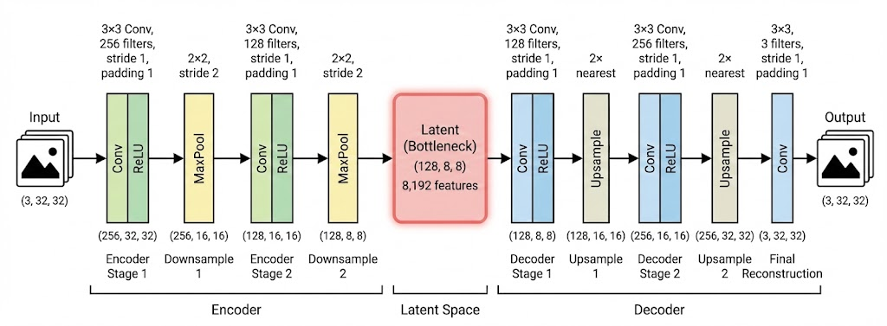
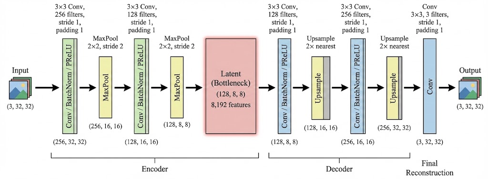

# CSC14120 - Parallel Programming: Autoencoder Feature Learning

<p align="center">
  <strong>Vietnam National University, Ho Chi Minh City</strong><br>
  University of Science - Faculty of Information Technology
</p>

<p align="center">
  
  
  
  
  
  
</p>

---

## Project Overview

This project implements a **GPU-accelerated Convolutional Autoencoder** for unsupervised feature learning on CIFAR-10, achieving **~505× speedup** over CPU baseline and **~71.2% classification accuracy** using extracted features with SVM.

### Demo Video

https://youtu.be/6ZOK-FqO-T4


### Group Members

| Member | Name | Student ID |
|:------:|:-----|:-----------|
| 1 | Le Dai Hoa | 22120108 |
| 2 | Nguyen Tuong Bach Hy | 22120455 |
| 3 | Le Hoang Vu | 22120461 |

### Key Achievements

| Metric | Target | Achieved | Status |
|:-------|:-------|:---------|:------:|
| GPU Speedup | >50× | **~505×** | Exceeded |
| Classification Accuracy | >50% | **~71.2%** | Exceeded |
| Training Time (50K images) | approx. 10 min | **~10.3 min** | Met |

---

## Implementation Phases

| Phase | Description | Training Time (50K) | Speedup vs CPU | Incremental Speedup | Key Optimization |
|:-----:|:------------|:--------------------|:---------------|:--------------------|:-----------------|
| **1** | CPU Baseline | ~86.7 hours | 1.0× | - | OpenMP |
| **2** | GPU Basic | ~102.1 min | ~51× | 51× | Basic parallelization |
| **3.1** | GPU Tiled | ~10.3 min | **~505×** | ~10× | Shared memory |
| **3.2** | GPU cuDNN | ~10.8 min | ~482× | ~1× | cuDNN library |
| **3.3** | GPU BCE | ~10.8 min | ~482× | - | BCE loss function |
| **4** | SVM Classification | - | - | - | cuML GPU-accelerated SVM |

### Phase 3 Comparison

| Version | Training Time | Final Loss | SVM Accuracy | Best For |
|:--------|:--------------|:-----------|:-------------|:---------|
| Tiled | ~10.3 min | 0.0114 | ~69.2% | Learning CUDA optimization |
| cuDNN | ~10.8 min | 0.0114 | ~69.2% | Production deployment |
| **BCE** | ~10.8 min | 0.55 | **~71.2%** | Best classification accuracy |

> [!TIP]
> The **BCE loss version** produces better features for classification, because BCE gradients are more stable for pixel-wise reconstruction.

---

## Network Architecture

### CPU Architecture
<p align="center">
  
</p>

> [!IMPORTANT]
> **CPU Architecture Design:** The CPU baseline uses a simple **Conv + ReLU** architecture without BatchNorm. This intentional simplicity serves Phase 1's goal of creating a baseline for correctness verification and performance measurement. Keeping the architecture simple makes debugging easier and enables direct output comparison between CPU and GPU implementations.

### GPU Architecture
<p align="center">
  
</p>

> [!IMPORTANT]
> **GPU Architecture Enhancements:** The GPU version adds **BatchNorm** and **PReLU** layers. With GPU's compute power, we can include these complex components without impacting training time:
> - **BatchNorm:** Uses batch mean/variance during training, accumulated running stats during inference. Impact: +5-10% accuracy and stabilized training. *Note: A common implementation bug is failing to distinguish between training and inference modes.*
> - **PReLU (Parametric ReLU):** `f(x) = max(0,x) + α[c] * min(0,x)` where α is learnable per-channel (initialized at 0.25), unlike LeakyReLU's fixed 0.01 slope. The model learns optimal slopes for each channel with minimal parameter overhead.
> - **Sigmoid:** Only applied when training with BCE loss. MSE loss (Phase 2, Version 2) outputs directly from decoder since MSE doesn't require outputs in [0,1] range.
> - **Latent Space:** Both architectures use **128×8×8 = 8,192 features** as the bottleneck representation, which is later extracted for SVM classification.

---

## Detailed Breakdown

### Phase 1: CPU Baseline
- **Implementation:** Standard C++ with OpenMP for multi-threading.
- **Performance:** ~86.7 hours training time (`0.3 img/sec`).
- **Bottleneck:** Sequential processing and lack of vectorization.

### Phase 2: GPU Naive (Foundation)
- **Implementation:** Ported logic to CUDA using global memory.
- **Performance:** ~102 minutes training time (`163 img/sec`).
- **Speedup:** ~51× vs CPU.
- **Bottleneck:** Global memory bandwidth saturation.

### Phase 3: GPU Optimized (Peak Performance)
- **Goal:** Maximize hardware utilization.
- **Techniques:**
  1. **Shared Memory Tiling:** Loaded image blocks into L1/Shared memory to reuse data, reducing global memory access by 3-4×. Each input pixel is read once into shared memory then reused by multiple threads.
  2. **cuDNN Integration:** Leveraged NVIDIA's optimized convolution algorithms (GEMM-based, Winograd, FFT) with automatic algorithm selection.
  3. **Vectorized Operations:** Used `float4` to process 4 floats simultaneously, increasing memory bandwidth and instruction throughput.
  4. **Double Buffering:** Created concurrent CPU-GPU pipelines with pinned memory to hide data transfer latency.
- **Performance:** **~10.3 min** training time (`1,618 img/sec`).
- **Speedup:** **~505×** vs CPU.

### Phase 4: BCE Loss + Advanced Training (Model Quality)
- **Goal:** Improve feature learnability for classification.
- **Techniques:**
  - **Loss Function:** Replaced MSE with **Binary Cross-Entropy (BCE)** combined with **Sigmoid** activation.
  - **Optimizer:** Adopted **AdamW** (decoupled weight decay) for adaptive per-parameter learning rates.
  - **LR Schedule:** Linear warmup (5 epochs) + Cosine Annealing for smooth convergence.
  - **Architecture:** Replaced ReLU with **PReLU** (Parametric ReLU) to prevent dying neurons.
  - **Data Augmentation:** Horizontal flip, random crop, and cutout for regularization.

**Why Change the Loss Function?**

| Feature | MSE (Phase 2-3) | BCE + Sigmoid (Phase 4) |
|:--------|:----------------|:------------------------|
| **Output Range** | Unbounded $(-\infty, \infty)$ | Strictly $[0, 1]$ (Matches Pixels) |
| **Gradient Behavior** | Linear with error (slow at convergence) | Steep near errors (fast correction) |
| **Reconstruction** | Tends to produce blurry images | Sharp edges and clear details |

**Advanced Training Components:**

1. **PReLU Integration:** Unlike standard ReLU which zeroes out negative gradients ("dead neurons"), PReLU introduces a learnable slope $\alpha$ for negative inputs, adapting to the data distribution. Each channel learns its optimal slope.

2. **AdamW Optimizer:** Combines momentum (tracking gradient direction) with adaptive learning rates (tracking gradient magnitude). Decoupled weight decay ensures effective regularization without gradient interference.

3. **Warmup + Cosine Schedule:** 
   - Warmup: LR starts at 20% and increases to 100% over 5 epochs, allowing BatchNorm stats to stabilize.
   - Cosine Annealing: Smooth decay from 100% to 0.1%, enabling exploration early and exploitation late.

4. **Gradient Clipping:** Essential for BCE loss where gradients can explode when predictions are near 0 or 1. Per-element clipping with `max_norm=1.0` prevents NaN/Inf.

- **Result:** Maintains peak performance (**~505× speedup**) while achieving **highest classification accuracy (~71.2%)**.

### Phase 5: Feature Extraction + SVM Classification
- **Goal:** Evaluate learned representations on downstream classification.
- **Pipeline:**
  1. Extract 8,192-dimensional latent features from trained encoder.
  2. Apply L2 normalization to handle varying feature scales.
  3. Train SVM with RBF kernel on normalized features.
- **Acceleration:** cuML (RAPIDS) provides 15-30× speedup over sklearn for PCA and SVM.
- **Result:** ~71.2% accuracy on CIFAR-10 test set.

---

## Results Summary

### Training Performance

| Phase | Training Time (50K) | Speedup vs CPU | Incremental Speedup | Key Optimization |
|:------|:--------------------|:---------------|:--------------------|:-----------------|
| CPU Baseline | ~86.7 hours | 1.0× | - | OpenMP |
| GPU Basic | ~102.1 min | ~51× | 51× | Basic parallelization |
| **GPU Tiled** | **~10.3 min** | **~505×** | ~10× | Shared memory |
| GPU cuDNN | ~10.8 min | ~482× | ~1× | cuDNN library |
| GPU BCE | ~10.8 min | ~482× | - | BCE loss function |

### Classification Accuracy (SVM on Extracted Features)

| Phase | Test Accuracy | Best Class | Worst Class |
|:------|:--------------|:-----------|:------------|
| Phase 1 CPU | ~69.2% | automobile | cat |
| Phase 2 GPU Naive | ~69% | ship | cat |
| Phase 3 Tiled | ~69.2% | ship | cat |
| Phase 3 cuDNN | ~69.2% | ship  | cat |
| **Phase 3 BCE** | **~71.2%** | automobile  (~80.7%) | cat (~57.2%) |

---

## Quick Start

```bash
# 1. Clone repository
git clone https://github.com/PrORain-HCMUS/Homogenous-AutoEncoder.git
cd Homogenous-AutoEncoder

# 2. Download CIFAR-10 dataset
cd data
curl -O https://www.cs.toronto.edu/~kriz/cifar-10-binary.tar.gz
tar -xzf cifar-10-binary.tar.gz
mv cifar-10-batches-bin/* .
cd ..

# 3. Run notebooks (recommended)
# See the Notebooks section below for ready-to-use Colab/Kaggle notebooks
```

> [!TIP]
> **Recommended:** Use our pre-configured notebooks on [Google Colab](https://github.com/PrORain-HCMUS/Homogenous-AutoEncoder/blob/feat/enhancement/notebooks) or [Kaggle](https://github.com/PrORain-HCMUS/Homogenous-AutoEncoder/blob/feat/enhancement/notebooks) for the easiest setup with GPU support. See the [Notebooks](#notebooks) section for all available options.

---

## Project Structure

```
Homogenous-AutoEncoder/
├── assets/
│   └── img/                    # Architecture diagrams
│       ├── cpu_architecture.jpg
│       └── gpu_architecture.jpg
├── command/                    # Build scripts
│   ├── build_all.bat
│   ├── build_phase1.bat
│   ├── build_phase2.bat
│   └── build_phase3.bat
├── data/                       # CIFAR-10 binary files
├── include/
│   ├── autoencoder.h           # CPU autoencoder class
│   ├── cuda_utils.h            # CUDA error checking
│   ├── dataset.h               # CIFAR-10 data loading
│   ├── gpu_augmentation.cuh    # GPU data augmentation
│   ├── gpu_autoencoder.h       # GPU autoencoder class
│   ├── gpu_layer.h             # GPU layer definitions
│   ├── gpu_memory_pool.cuh     # GPU memory management
│   ├── layer.h                 # CPU layer definitions
│   └── svm_wrapper.h           # SVM wrapper for classification
├── notebooks/                  # Jupyter notebooks
│   ├── report_base.ipynb
│   ├── report_github.ipynb
│   └── report.ipynb
├── results/                    # Training logs and results
│   ├── phase-1/
│   │   ├── cpu_phase1_log.csv  # CPU training metrics
│   │   └── cpu_training.csv    # CPU training summary
│   ├── phase-2/
│   │   ├── phase2.csv          # GPU naive training metrics
│   │   └── phase2.txt          # GPU naive training log
│   └── phase-3/
│       ├── phase3_bce.csv      # BCE loss training metrics
│       ├── phase3_bce.txt      # BCE loss training log
│       ├── phase3_opt.csv      # Optimized GPU training metrics
│       ├── phase3_opt.txt      # Optimized GPU training log
│       ├── phase3_tiled.csv    # Tiled convolution metrics
│       └── phase3_tiled.txt    # Tiled convolution log
├── src/
│   ├── autoencoder.cpp         # CPU autoencoder
│   ├── dataset.cpp             # Data loading
│   ├── gpu_autoencoder.cu      # GPU autoencoder
│   ├── layers_cpu.cpp          # CPU layer implementations
│   ├── layers_gpu.cu           # Naive GPU kernels (Phase 2)
│   ├── layers_gpu_opt.cu       # Optimized GPU kernels (Phase 3)
│   ├── main.cpp                # CPU training (Phase 1)
│   ├── main_gpu.cu             # GPU training (Phase 2-3)
│   ├── main_phase4.cu          # Full pipeline with SVM (Phase 4)
│   ├── svm_wrapper.cpp         # SVM implementation
│   └── verify_gpu.cu           # GPU verification
├── .gitignore
├── Description.pdf
├── final_project.md
├── Makefile
└── README.md
```

> [!IMPORTANT]
> For the full project report with detailed analysis, see [`docs/report.pdf`](docs/report.pdf) or run the [`report.ipynb`](https://github.com/PrORain-HCMUS/Homogenous-AutoEncoder/blob/report/notebooks/report.ipynb) notebook.

---

## Notebooks

All notebooks are available in the [`feat/enhancement`](https://github.com/PrORain-HCMUS/Homogenous-AutoEncoder/tree/feat/enhancement/notebooks) branch. We also provide you with both Google Colab and Kaggle versions for each phase and methods:

### Phase 2: GPU Naive
- [`Phase2_Colab.ipynb`](https://github.com/PrORain-HCMUS/Homogenous-AutoEncoder/blob/feat/enhancement/notebooks/Phase2_Colab.ipynb)
- [`Phase2_Kaggle.ipynb`](https://github.com/PrORain-HCMUS/Homogenous-AutoEncoder/blob/feat/enhancement/notebooks/Phase2_Kaggle.ipynb)

### Phase 3: GPU Optimized
- [`Phase3_Colab.ipynb`](https://github.com/PrORain-HCMUS/Homogenous-AutoEncoder/blob/feat/enhancement/notebooks/Phase3_Colab.ipynb) - CuDNN Integration
- [`Phase3_Kaggle.ipynb`](https://github.com/PrORain-HCMUS/Homogenous-AutoEncoder/blob/feat/enhancement/notebooks/Phase3_Kaggle.ipynb)
- [`Phase3_Colab_BCE.ipynb`](https://github.com/PrORain-HCMUS/Homogenous-AutoEncoder/blob/feat/enhancement/notebooks/Phase3_Colab_BCE.ipynb) - BCE loss version
- [`Phase3_Kaggle_BCE.ipynb`](https://github.com/PrORain-HCMUS/Homogenous-AutoEncoder/blob/feat/enhancement/notebooks/Phase3_Kaggle_BCE.ipynb)
- [`Phase3_Colab_Tiled.ipynb`](https://github.com/PrORain-HCMUS/Homogenous-AutoEncoder/blob/feat/enhancement/notebooks/Phase3_Colab_Tiled.ipynb) - Tiled convolution
- [`Phase3_Kaggle_Tiled.ipynb`](https://github.com/PrORain-HCMUS/Homogenous-AutoEncoder/blob/feat/enhancement/notebooks/Phase3_Kaggle_Tiled.ipynb)

### Phase 4: SVM Classification
- [`Phase4_Colab.ipynb`](https://github.com/PrORain-HCMUS/Homogenous-AutoEncoder/blob/feat/enhancement/notebooks/Phase4_Colab.ipynb)
- [`Phase4_Kaggle.ipynb`](https://github.com/PrORain-HCMUS/Homogenous-AutoEncoder/blob/feat/enhancement/notebooks/Phase4_Kaggle.ipynb)
- [`Phase4_Kaggle_PCA.ipynb`](https://github.com/PrORain-HCMUS/Homogenous-AutoEncoder/blob/feat/enhancement/notebooks/Phase4_Kaggle_PCA.ipynb) - With PCA

### Best Optimized version for Phase 3-4
- [`Phase3-4-Colab.ipynb`](https://github.com/PrORain-HCMUS/Homogenous-AutoEncoder/blob/feat/enhancement/notebooks/Phase3-4-Colab.ipynb) - BCE + cuML SVM
- [`Phase3-4-Kaggle.ipynb`](https://github.com/PrORain-HCMUS/Homogenous-AutoEncoder/blob/feat/enhancement/notebooks/Phase3-4-Kaggle.ipynb)

### Full Report
- [`report.ipynb`](https://github.com/PrORain-HCMUS/Homogenous-AutoEncoder/blob/main/notebooks/report.ipynb) - Complete project report with all phases 

---

## Build Targets

| Target | Description | Command |
|:-------|:------------|:--------|
| `cpu_train` | CPU baseline (no OpenMP) | `make cpu_train` |
| `cpu_train_omp` | CPU with OpenMP | `make cpu_train_omp` |
| `gpu_train` | GPU naive (Phase 2) | `make gpu_train` |
| `gpu_train_opt` | GPU optimized (Phase 3) | `make gpu_train_opt` |
| `full_pipeline` | Full pipeline with SVM (Phase 4) | `make full_pipeline` |
| `feature_extractor` | Extract features only | `make feature_extractor` |

---

## Requirements

**GPU Build:**
- CUDA Toolkit 11.0+
- NVIDIA GPU (compute capability 6.0+)
- cuDNN (optional, for cuDNN version)

**CPU Build:**
- C++17 compiler (GCC 9+, Clang 10+, MSVC 2019+)
- OpenMP (optional)

**SVM Classification (Phase 4):**
- cuML (recommended for GPU)
- ThunderSVM or sklearn (alternatives)

---

## References

### Datasets & Tools
- [CIFAR-10 Dataset](https://www.cs.toronto.edu/~kriz/cifar.html)
- [cuDNN Documentation](https://docs.nvidia.com/deeplearning/cudnn/)
- [cuML SVM](https://docs.rapids.ai/api/cuml/stable/)

### Research Papers
- Hinton & Salakhutdinov (2006). ["Reducing the Dimensionality of Data with Neural Networks"](https://www.science.org/doi/10.1126/science.1127647)
- Loshchilov & Hutter (2017). ["SGDR: Stochastic Gradient Descent with Warm Restarts"](https://arxiv.org/abs/1608.03983)
- Goyal et al. (2017). ["Accurate, Large Minibatch SGD: Training ImageNet in 1 Hour"](https://arxiv.org/abs/1706.02677)

### Related Projects
- [LVI CIFAR-100 Classifier PyTorch](https://github.com/Bigeco/lvi-cifar100-classifier-pytorch) - Reference implementation for CIFAR classification

> [!NOTE]
> **Key Learnings from References:**
> - **SGDR paper:** Informed our learning rate scheduling strategy with warm restarts, which helps escape local minima and improves convergence on CIFAR-10.
> - **Large Minibatch SGD paper:** Guided our batch size selection and learning rate scaling rules. The linear scaling rule (lr × batch_size/256) was crucial for stable training with larger batches on GPU.
> - **LVI CIFAR-100 project:** Provided practical insights on autoencoder architecture design and feature extraction strategies for image classification tasks.

---

## FAQ

<details>
<summary><strong>Why implement from scratch instead of using PyTorch/TensorFlow?</strong></summary>

The primary goal of this project is educational - understanding how deep learning libraries work at a low-level. By implementing everything from scratch in CUDA C++, we gain deep insight into forward pass, backward pass, gradient computation, and optimization mechanics. This knowledge helps with debugging and optimization in real-world scenarios.
</details>

<details>
<summary><strong>cuDNN vs Tiled Convolution - when to use which?</strong></summary>

- **cuDNN:** Best for production deployments. It's the fastest option, heavily optimized by NVIDIA engineers for each GPU architecture with algorithms like Winograd and Tensor Core utilization.
- **Tiled Convolution:** Best for learning and understanding GPU optimization principles. Also useful when you can't have external dependencies. In practice, most frameworks (PyTorch, TensorFlow) use cuDNN under the hood.
</details>

<details>
<summary><strong>Is ~71% accuracy considered good for CIFAR-10?</strong></summary>

CIFAR-10 state-of-the-art is ~99% with complex architectures like ResNet, EfficientNet, or Vision Transformers. However, the focus of this project is **GPU optimization and parallel programming**, not achieving SOTA accuracy. Achieving ~71% with unsupervised feature learning (autoencoder) + SVM is a reasonable baseline that demonstrates the features learned are meaningful.
</details>

<details>
<summary><strong>Why use SVM instead of fully-connected layers for classification?</strong></summary>

1. **Simplicity:** SVM works well with pre-extracted features without additional training loops.
2. **Interpretability:** Support vectors can be analyzed to understand decision boundaries.
3. **Efficiency:** With good features, SVM training is fast and doesn't require GPU.
4. **Separation of concerns:** Clearly separates feature learning (autoencoder) from classification (SVM).

In production, you could replace SVM with FC layers and fine-tune end-to-end for potentially better results.
</details>

<details>
<summary><strong>What is the most common BatchNorm implementation bug?</strong></summary>

Failing to distinguish between **training mode** and **inference mode**:
- **Training:** Use batch statistics (mean/variance computed from current batch) and update running statistics with momentum.
- **Inference:** Use accumulated running statistics (not batch statistics).

Using running stats during training (especially early training when they're initialized to 0/1) leads to incorrect normalization and prevents the model from learning. This single bug can cause 5-10% accuracy drop.
</details>

<details>
<summary><strong>Why does BCE Loss produce better features than MSE for classification?</strong></summary>

1. **Gradient dynamics:** BCE gradients are steep when predictions are wrong (near 0 or 1), forcing faster correction. MSE gradients are linear and can be small near convergence.
2. **Output semantics:** BCE with Sigmoid constrains outputs to [0,1], matching pixel value range. MSE allows unbounded outputs.
3. **Reconstruction quality:** BCE encourages the model to "commit" to values near 0 or 1, producing sharper reconstructions with clearer edges. MSE tends to average possibilities, creating blurry images.

Sharper reconstructions indicate the encoder learned more discriminative features.
</details>

---

## License

This project is for educational purposes as part of CSC14120 - Parallel Programming course.
