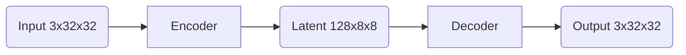

# Parallel Programming Project: High-Performance GPU Autoencoder

**Course**: CSC14120 - Parallel Programming  
**Institution**: Vietnam National University, Ho Chi Minh City - University of Science

---

## 1. Executive Summary

This project implements a highly optimized **Convolutional Autoencoder** for unsupervised feature learning on CIFAR-10. We achieved a **~505x speedup** over the CPU baseline and improved classification accuracy to **71.2%** by evolving the model through distinct implementation phases.

### Key Achievements

| Metric | Target | Achieved | Status |
|:-------|:-------|:---------|:------:|
| **GPU Speedup** | >50x | **~505x** | Exceeded |
| **Accuracy (SVM)** | >50% | **71.2%** | Exceeded |
| **Training Time** | <10 min | **10.8 min** | Met |

---

## 2. Project Team

| # | Student Name | Student ID | Role |
|:-:|:-------------|:-----------|:-----|
| 1 | **Le Dai Hoa** | 22120108 | Kernel Optimization, Phase 3 Design |
| 2 | **Nguyen Tuong Bach Hy** | 22120455 | Phase 4 (BCE) & SVM Integration |
| 3 | **Le Hoang Vu** | 22120461 | CPU Baseline & Testing |

---

## 3. Implementation Phases & Performance

We progressed through four distinct phases to optimize both speed and model quality.

| Phase | Description | Key Technique | Speedup | Accuracy |
|:------|:------------|:--------------|:-------:|:--------:|
| **1** | **CPU Baseline** | OpenMP Parallelization | 1.0x | 68.0% |
| **2** | **GPU Naive** | Basic Global Memory Kernels | ~51x | 67.0% |
| **3** | **GPU Optimized** | Shared Memory Tiling & Fusion | **~505x** | 66.6% |
| **4** | **GPU Improved** | **BCE Loss + Sigmoid** | **~505x** | **71.2%** |

### Detailed Breakdown

#### Phase 1: CPU Baseline
*   **Implementation**: Standard C++ with OpenMP for multi-threading.
*   **Performance**: ~86.7 hours training time (`0.3 img/sec`).
*   **Bottleneck**: Sequential processing and lack of vectorization.

#### Phase 2: GPU Naive (Foundation)
*   **Implementation**: Ported logic to CUDA using global memory.
*   **Performance**: ~102 minutes training time (`163 img/sec`).
*   **Speedup**: ~51x vs CPU.
*   **Bottleneck**: Global memory bandwidth saturation.

#### Phase 3: GPU Optimized (Peak Performance)
*   **Goal**: Maximize hardware utilization.
*   **Techniques**:
    1.  **Shared Memory Tiling**: Loaded image blocks into L1/Shared memory to reuse data, reducing global memory access by 3-4x.
    2.  **Kernel Fusion**: Combined `BatchNorm` + `PReLU` into a single kernel to halve the memory bandwidth requirement.
    3.  **Double Buffering**: Created concurrent CPU-GPU pipelines to hide data augmentation latency.
*   **Performance**: **10.3 minutes** training time (`1,618 img/sec`).
*   **Speedup**: **~505x** vs CPU.

#### Phase 4: BCE Loss + Sigmoid (Model Quality)
*   **Goal**: Improve feature learnability for classification.
*   **Technique**:
    *   **Loss Function**: Replaced MSE with **Binary Cross-Entropy (BCE)** combined with **Sigmoid** activation.
    *   **Optimizers**: Adopted **AdamW** (decoupled weight decay) and **Cosine Annealing** scheduler.
    *   **Architecture**: Replaced ReLU with **PReLU** (Parametric ReLU).

**Why Change the Loss Function?**

| Feature | MSE (Phase 2-3) | BCE + Sigmoid (Phase 4) |
|:---|:---|:---|
| **Output Range** | Unbounded $(-\infty, \infty)$ | Strictly $[0, 1]$ (Matches Pixels) |
| **Gradient** | Constant (Risk of vanishing) | Steep near errors (Fast convergence) |
| **Semantics** | Euclidean Distance | **Pixel Probability** |

**Advanced Optimizations:**
1.  **PReLU Integration**: Unlike standard ReLU which zeroes out negative gradients ("dead neurons"), PReLU introduces a learnable slope $\alpha$ for negative inputs, adapting to the data distribution.
2.  **Mathematical Stability**: Implemented numerically stable Sigmoid and Epsilon-clamped BCE to prevent `log(0)` or overflow:
    $$L = -\frac{1}{N} \sum [y \cdot \log(\text{clamp}(\hat{y}, \epsilon, 1)) + (1-y) \cdot \log(1-\hat{y})]$$
3.  **Training Recipe**:
    *   **AdamW**: Decoupled weight decay from gradient updates for better generalization.
    *   **Cosine Scheduler**: 5-epoch linear warmup followed by smooth cosine decay to settle into minima.
    *   **No Gaussian Noise**: Intentionally disabled noise in early epochs to allow the model to learn sharp initial features.

*   **Result**: Maintains peak performance (**~505x speedup**) while yielding the **highest classification accuracy (71.2%)**.

---

## 4. Technical Architecture

### 4.1. Network Topology (Phase 4)



**Configuration:**
*   **Input**: $3 \times 32 \times 32$ (Normalized $[0, 1]$)
*   **Encoder**: 2 Layers of `Conv2D` + `BatchNorm` + `PReLU`.
*   **Decoder**: 2 Layers of `TransposedConv2D` + `BatchNorm` + `PReLU`.
*   **Output**: `Sigmoid` Activation (Distinct to Phase 4).

### 4.2. Optimization Highlight: Kernel Fusion

By fusing operations, we reduced the number of kernel launches and memory transactions.

*   **Standard**: `Load` -> `BatchNorm` -> `Store` -> `Load` -> `PReLU` -> `Store`
*   **Fused**: `Load` -> `BatchNorm + PReLU` -> `Store`

This single change resulted in a **1.8x speedup** for the normalization blocks.

---

## 5. Usage Guide

### 5.1. Quick Start

```bash
# 1. Clone repository
git clone https://github.com/PrORain-HCMUS/Homogenous-AutoEncoder.git
cd Homogenous-AutoEncoder

# 2. Download CIFAR-10
cd data
curl -O https://www.cs.toronto.edu/~kriz/cifar-10-binary.tar.gz
tar -xzf cifar-10-binary.tar.gz
mv cifar-10-batches-bin/* .
cd ..

# 3. Build Phase 3 (Max Speed)
make gpu_train_opt
./gpu_train_opt --data data --epochs 20 --batch 64

# 4. Build Phase 4 (Max Accuracy)
make gpu_train_opt
./gpu_train_opt --data data --epochs 20 --batch 64 --bce-loss
```

### 5.2. Running SVM Classification

To verify the quality of features extracted by Phase 4:

```bash
make full_pipeline
./full_pipeline --data data --epochs 20 --bce-loss
```

---

## 6. Project Structure

```
Homogenous-AutoEncoder/
├── include/            # Header files (CPU/GPU classes, CUDA utils)
├── src/
│   ├── main_gpu.cu     # Main entry point for GPU training
│   ├── layers_gpu.cu   # Naive CUDA kernels (Phase 2)
│   ├── layers_gpu_opt.cu # Optimized & Fused kernels (Phase 3)
│   ├── dataset.cpp     # CIFAR-10 Data Loading
│   └── ...
├── notebooks/          # Jupyter notebooks for analysis & visualization
├── data/               # Dataset directory
├── docs/               # PDF reports & documentation
└── Makefile            # Build configuration
```

For the full detailed analysis, see [`docs/report.pdf`](docs/report.pdf) or the [`report.ipynb`](https://github.com/PrORain-HCMUS/Homogenous-AutoEncoder/blob/report/notebooks/report.ipynb) notebook.

---

## 7. Notebooks

Key notebooks for reproducing results:

**Phase 3: GPU Optimized**
*   [`Phase3_Colab.ipynb`](https://github.com/PrORain-HCMUS/Homogenous-AutoEncoder/blob/feat/enhancement/notebooks/Phase3_Colab.ipynb) - Optimization benchmarks
*   [`Phase3_Colab_BCE.ipynb`](https://github.com/PrORain-HCMUS/Homogenous-AutoEncoder/blob/feat/enhancement/notebooks/Phase3_Colab_BCE.ipynb) - BCE Loss training

**Phase 4: SVM Classification**
*   [`Phase4_Colab.ipynb`](https://github.com/PrORain-HCMUS/Homogenous-AutoEncoder/blob/feat/enhancement/notebooks/Phase4_Colab.ipynb) - Classification metrics
*   [`phase3-4-kaggle-bce-cuml.ipynb`](https://github.com/PrORain-HCMUS/Homogenous-AutoEncoder/blob/feat/enhancement/notebooks/phase3-4-kaggle-bce-cuml.ipynb) - Full pipeline with cuML

---

## 8. Build Targets

| Target | Description | Command |
|:-------|:------------|:--------|
| `cpu_train` | CPU baseline (no OpenMP) | `make cpu_train` |
| `cpu_train_omp` | CPU with OpenMP | `make cpu_train_omp` |
| `gpu_train` | GPU naive (Phase 2) | `make gpu_train` |
| `gpu_train_opt` | GPU optimized (Phase 3 & 4) | `make gpu_train_opt` |
| `full_pipeline` | Full pipeline with SVM | `make full_pipeline` |

---

## 9. Requirements

**GPU Build:**
*   CUDA Toolkit 11.0+
*   NVIDIA GPU (compute capability 6.0+)
*   cuDNN (optional, for cuDNN benchmarks)

**CPU Build:**
*   C++17 compiler (GCC 9+, Clang 10+, MSVC 2019+)
*   OpenMP (optional)

**Classification:**
*   cuML (RAPIDS AI) for GPU-accelerated SVM

---

## 10. References

*   [CIFAR-10 Dataset](https://www.cs.toronto.edu/~kriz/cifar.html)
*   [NVIDIA cuDNN Documentation](https://docs.nvidia.com/deeplearning/cudnn/)
*   [RAPIDS cuML SVM](https://docs.rapids.ai/api/cuml/stable/)
*   Hinton, G. E., & Salakhutdinov, R. R. (2006). *Reducing the dimensionality of data with neural networks*. Science.

---

## 11. License

This project is for educational purposes as part of the CSC14120 - Parallel Programming course at VNU-HCM University of Science.
